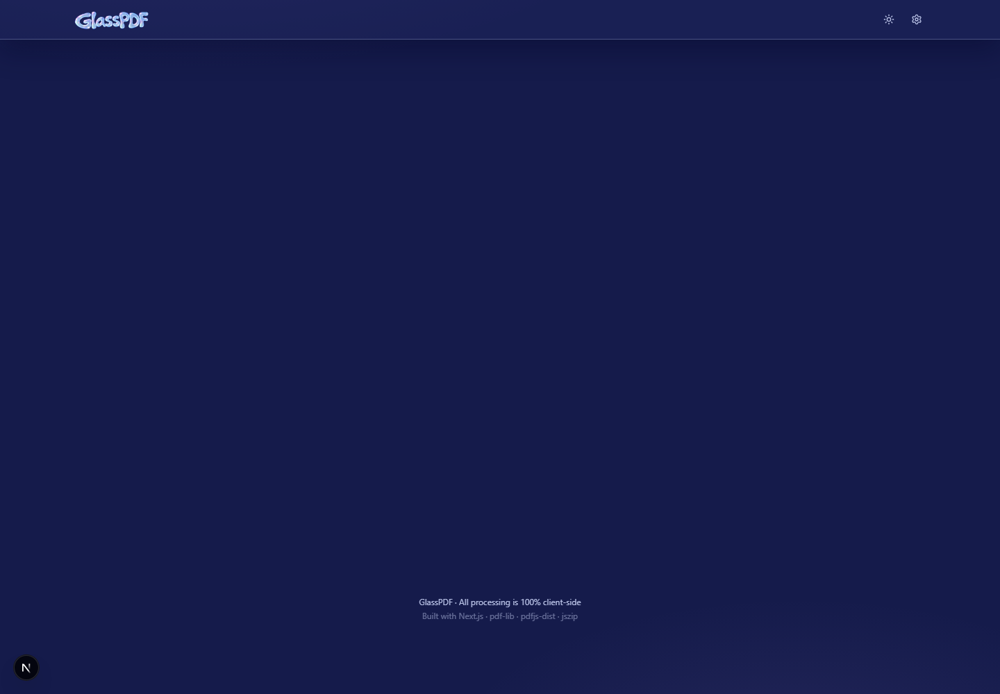

# GlassPDF

A private, browser-based PDF toolkit with a glossy Frutiger Aero interface. GlassPDF lets you work with documents locally: your files are processed in your browser and are not uploaded to a server.



## Features

- Merge several PDFs into one document
- Split, reorder, rotate, and remove PDF pages
- Convert text-based PDFs to EPUB
- Create PDFs from PNG, JPG, and WebP images
- Add text watermarks and password protection
- Keep recent activity on the device
- Light Frutiger Aero design with an optional twilight glass dark mode

## Run locally

### Requirements

- [Node.js](https://nodejs.org/) 20 or newer
- npm (included with Node.js)

### Setup

Clone the project and install its dependencies:

```bash
git clone https://github.com/karllimjuco/GlassPDF.git
cd GlassPDF
npm install
```

Start the development server:

```bash
npm run dev
```

Open [http://localhost:3000](http://localhost:3000) in your browser. The page automatically refreshes as you edit source files.

### Production build

To create and run an optimized local production build:

```bash
npm run build
npm run start
``

Then visit [http://localhost:3000](http://localhost:3000).

## Privacy

GlassPDF is designed for local processing. PDF operations run client-side using browser-compatible libraries, so documents stay on your device during normal use. As with any web application, review the source and deployment configuration before using it with sensitive files.

## Tech stack

- Next.js and React
- TypeScript
- Tailwind CSS
- pdf-lib, pdfjs-dist, JSZip, and @pdfsmaller/pdf-encrypt

## Contributing

Issues, feature requests, and pull requests are welcome. For larger changes, please open an issue first so the approach can be discussed.

## License

GlassPDF is open source under the [MIT License](LICENSE).
